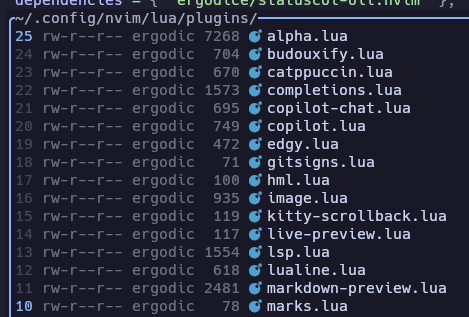

# statuscol-oil.nvim

> Bring Oil's metadata columns into the Status Column.

`statuscol-oil.nvim` integrates **oil.nvim** with **statuscol.nvim**, allowing Oil's metadata columns to be rendered directly inside the Status Column.

No more accidentally moving the cursor into permissions, file sizes, or owner fields.

✨ Small change. Smoother workflow.

 

## 📸 What does it do?

### Before

```text
-rw-r--r-- user 1.2K 📄 README.md
^
Cursor can move here
```

### After

```text
│-rw-r--r-- user 1.2K 📄│ README.md
                           ^
                    Cursor stays here
```

Metadata is displayed in the Status Column, while the editable buffer contains only file names.

## ✨ Features

### 🗂️ Render Oil columns inside StatusColumn

Move Oil metadata out of the editable buffer and into the Status Column:

* 🔐 Permissions
* 👤 Owner (UID/GID)
* 📦 File size
* 🎨 File icons
* ⬜ Custom spacing columns

### 🚀 Extra QoL Improvements

In addition to relocating Oil metadata, this plugin adds several small but useful enhancements:

* 👤 UID/GID display support
* 📏 Configurable size column width
* 📦 Human-readable file sizes
* 🕒 Custom modification time formatting
* 🛠️ Additional usability improvements

## 🎯 Why?

Oil treats metadata as part of the buffer.

While functional, this means:

* ❌ Cursor can move into metadata fields
* ❌ Metadata occupies editable buffer space
* ❌ File information and file names are visually mixed together

`statuscol-oil.nvim` solves this by moving metadata into the Status Column.

Result:

* ✅ Cleaner layout
* ✅ More intuitive cursor movement
* ✅ Better separation of content and metadata
* ✅ Less everyday friction

---

## 📦 Requirements

* Neovim ≥ 0.9
* statuscol.nvim
* oil.nvim
* nvim-web-devicons (recommended)

## ⚡ Installation

Using **lazy.nvim**:

```lua
return {
    "ergodice/statuscol-oil.nvim",
    dependencies = {
        "nvim-tree/nvim-web-devicons",
    },
    opts = {},
}
```

## 🔧 Configuration

Add the provided components to your `statuscol.nvim` setup like so...

```lua
local oil_cols = require("statuscol-oil")

require("statuscol").setup({
    setopt = true,
    relculright = false,
    segments = {
        { text = { "%s" }, click = "v:lua.ScSa" }, -- signs
        { text = { "%l" }, click = "v:lua.ScLa" }, -- line numbers
        { text = { " " } },

        oil_cols.permission,
        oil_cols.whitespace,

        oil_cols.owner,
        oil_cols.whitespace,

        oil_cols.size,
        oil_cols.whitespace,

        oil_cols.icon,
    },
})
```

🎉 That's it!

Also, The provided component are listed below.

| function     | Description                          |
|------------- | ------------------------------------ |
| `permission` | permission.                          |
| `icon`       | show icon with nvim-web-devicons.    |
| `size`       | file size.                           |
| `mtime`      | last updated time.                   |
| `owner`      | owner of file/folder                 |
| `group`      | The group to which the file belongs. |
| `whitespace` | single whitespace.                   |

> if you're in windows, permission, owner and group is ignored.

---

## ⚙️ Options

| Option              | Default               | Description |
|---------------------|-----------------------|-------------|
| `size_prefer_units` | `false`               | When both representations fit within `size_width`, prefer human-readable sizes (`1K`, `12M`) over raw byte counts (`1024`, `12582912`). |
| `size_width`        | `5`                   | Width of the size column |
| `mtime_format`      | `"%Y-%m-%d %H:%M:%S"` | Modification time format |
| `owner_width`       | `7`                   | Maximum length of the owner's text |

Example:

```lua
opts = {
    size_prefer_units = true,
    size_width = 6,
    mtime_format = "%Y-%m-%d %H:%M",
    owner_width = 10,
}
```

---

## 💡 Philosophy

This plugin exists to solve a tiny annoyance.

Metadata is useful to **see**.

Metadata is rarely useful to **edit**.

By moving metadata into the Status Column, Oil feels a little more natural, a little cleaner, and a little closer to how file browsers intuitively behave.

Sometimes the best plugins are the ones you stop noticing after a day of use.

---

## ❤️ Thanks

* stevearc/oil.nvim
* luukvbaal/statuscol.nvim
* nvim-tree/nvim-web-devicons

---

## 📜 License

MIT
